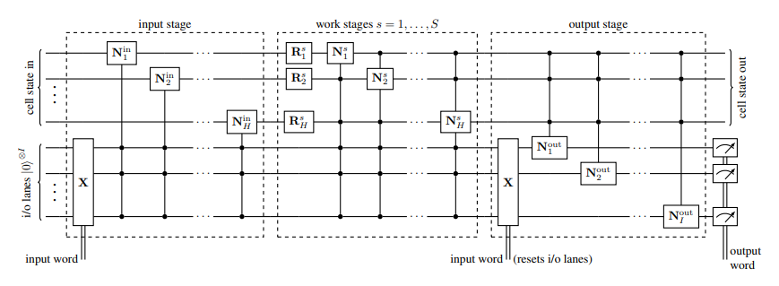

# Quantum Recurrent Neural Networks

The project is driven by the absence of any viable recurrent quantum network. Although Variational Quantum Eigensolvers (VQEs) exist, the resultant Quantum Circuits are very dense, compressing a lot of parameters into a relatively compact circuit [[1]](#references). The high density of entangling gates, lack of correlation between parameters results in highly over-parameterized models which are hard to train on classification tasks on inputs larger than a few bits.

## Introduction
This project focusses on constructing a QRNN, and compare it's performance on non-trivial tasks such as sequence learning and integer digit classification.

The reference paper exploits the nature of quantum mechanics. The interatcions of any quantum system can be described by a Hermitian Operator $\mathcal{H}$ which generates the system's time evolution under the unitary map:
$$U(t) = \exp(-itH)$$
which is a solution to the Schrodinger equation.

Further, any quantum circuit compresing a sequence of individual unitary quantum gates of the form $U_i(t_i)$ for a set of parameters $t_i$ is intrinsically unitary and inherently linear [[1]](#references). This is promising because then a parameterized quantum circuit serves as a prime candidate for a unitary recurrent network.

## QRNN Cell and Network
The fundamental building block is an improved type of quantum neuron based to introduce non-linearity [[2]](#references). In addition, we employ a type of fixed-point amplitude amplification (done during training) which alows the introduction of measurements. These both operations remains arbitrarily close to unitary. This implementation is the first quantum machine learning model capable of working with non-superposed training data.

There are three parts of the QRNN cell.
- The input stage, where at each step, it writes the current input into the cell state
- Multiple work stages, where it computes with input and cell states
- Final output stage, which creates a probability density over possible predictions.

Although the resulting circuits are deeper than VQEs, it only requires as many qubits as the input and cell states are wide.

The figures below show the QRNN Cell, and how it can be used to construct a QRNN.

<!-- 
$$\textit{QRNN Cell}$$

$$\textit{QRNN}$$ -->


# Setup
The code requires pytorch/tensorboard installation. Please refer to the original documentation of pytorch [here](https://pytorch.org/).

To install tensorboard:
```
pip install tensorboard
```

To install colorful:
```
pip install colorful
```

## Running
```
python main.py --help
python main.py train --help
python main.py resume --help
```

The memory requirements mostly go linear but in some cases may grow exponentially.

You may restart a training process if it is interrupted (may work, not tested thoroughly):
```
python main.py resume checkpoint-name.tar.gz
```