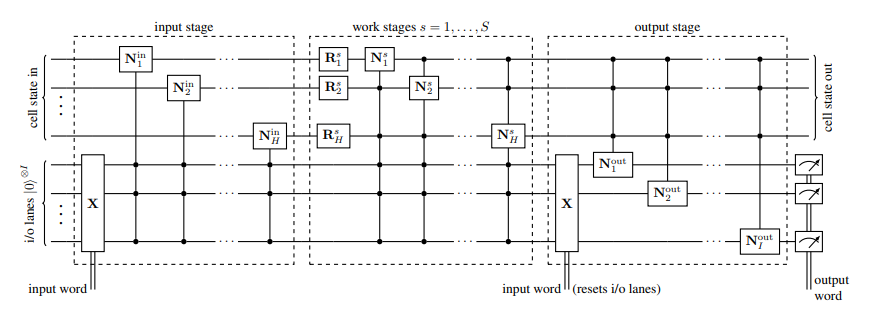
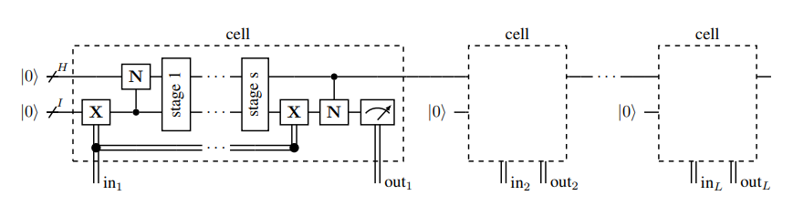

# Recurrent Quantum Neural Networks

## Introduction
The project is driven by the absence of any viable recurrent quantum network. Although Variational Quantum Eigensolvers (VQEs) exist, the resultant Quantum Circuits are very dense, compressing a lot of parameters into a relatively compact circuit [[1]](#quantum-neuron-an-elementary-building-block-for-machine-learning-on-quantum-computers). The high density of entangling gates, lack of correlation between parameters results in highly over-parameterized models which are hard to train on classification tasks on inputs larger than a few bits.

This project focusses on constructing a QRNN, and compare it's performance on non-trivial tasks such as sequence learning and integer digit classification.

The reference paper exploits the nature of quantum mechanics. The interatcions of any quantum system can be described by a Hermitian Operator $\bold{\mathcal{H}}$ which generates the system's time evolution under the unitary map:
$$U(t) = \exp(-itH)$$
which is a solution to the Schrodinger equation.

Further, any quantum circuit compresing a sequence of individual unitary quantum gates of the form $U_i(t_i)$ for a set of parameters $t_i$ is intrinsically unitary and inherently linear [[1]](#recurrent-quantum-neural-networks-1). This is promising because then a parameterized quantum circuit serves as a prime candidate for a unitary recurrent network.

## QNLP
We start with experiments on Quantum Natural Language Processing. This represents a fascination convergence between quantum computing and computational linguistics, aimed at enhancing natural language processing (NLP) tasks. We start off with a simple integration of lambeq and Pennylane libraries.

Further, we explore Procedural Generation, a field focusing on algorithmically generating content using computers. We also touch upon Natural Language Generation (NLG), which merges procedural generaltion and natural language processing. This is build upon previous work in quantum sentence classification, whcih involves annotating sentences with topics and converting them into parameterized quantum circuits.

Remember that we still have not employed any recursive structure in our experiments. Next we try to implement a QRNN for similar tasks.

## QRNN Cell and Network
The fundamental building block is an improved type of quantum neuron based to introduce non-linearity [[2]](#recurrent-quantum-neural-networks-1). In addition, we employ a type of fixed-point amplitude amplification (done during training) which alows the introduction of measurements. These both operations remains arbitrarily close to unitary. This implementation is the first quantum machine learning model capable of working with non-superposed training data.

There are three parts of the QRNN cell.
- The input stage, where at each step, it writes the current input into the cell state
- Multiple work stages, where it computes with input and cell states
- Final output stage, which creates a probability density over possible predictions.

Although the resulting circuits are deeper than VQEs, it only requires as many qubits as the input and cell states are wide.

The figures below show the QRNN Cell, and how it can be used to construct a QRNN.

$$\textit{QRNN Cell}$$

$$\textit{QRNN}$$

## Implementation
1. Quantum Natural Language Processing:
   - Define a training dataset
   - Make sentence pairs labeled according to their topical relevance
   - Construct hybrid model, trained to perform XOR operations
   - Discern if the sentences share the same topic
   - Upon training, the model demonstrates a clear capacity to differentiate between topics
2. Quantum Natural Language Generation:
   - Generate a random initial candidate sentence $C$
   - Create the parameterized quantum circuit corresponding to $C$ using lambeq
   - Run the circuit many times with optimal parameters, record the percentage of runs where the output bitstring corresponds to the correct topic is recorded
   - While the value $P(C) < threshold$ perform:
     - generate a neighboring sentence of $C$ called $C'$ by either inserting a new random word into $C$, deleting a random word from C or replacing a random word from $C$ with a new random word
     - if $P(C') > P(C)$ set $C = C'$ 
3. Quantum Recurrent Neural Network:
   - Create a custom dataset to feed the data vector in a one-hot fashion step-by-step as a state
   - Create custom layers for the QRNN Cell, which will further be employed in the QRNN

## Future
With regards to Quantum RNN:
1. Design Compound Layers
2. Design Gate Layers
3. Creating the QRNN cell
4. Run experiments for sequence memorization
5. Run experiments for complex MNIST classification

## References
##### [Recurrent Quantum Neural Networks](./references/2006.14619.pdf), Bausch J.
##### [Quantum Neuron: an elementary building block for machine learning on quantum computers](./references/1711.11240.pdf), Cao Y. et,al